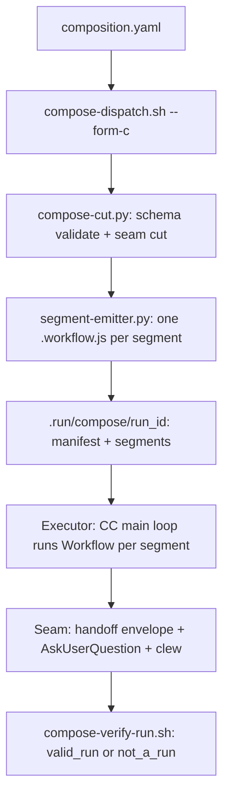

<!-- AGENT-CONTEXT
name: loa-laplas
type: framework
purpose: Loa composition runtime (Form C) — compiles composition.yaml into workflow segments cut at gate seams, executed by the Claude Code main loop with typed handoffs and a proof-of-run terminal gate
key_files: [CLAUDE.md, scripts/compose-dispatch.sh, scripts/compose-verify-run.sh, scripts/lib/compose-cut.py, scripts/lib/segment-emitter.py, skills/compose/SKILL.md]
interfaces: [compose-dispatch.sh, compose-verify-run.sh, /compose skill, legba.mjs, SubagentStart/Stop hooks]
dependencies: [git, jq, yq, bash, python3, node, bats]
version: v0.3.0
installation_mode: submodule
trust_level: L2-verified
-->

# loa-laplas

<!-- provenance: CODE-FACTUAL -->
The Loa composition runtime (Form C). Compiles `composition.yaml` into workflow
segments cut at gate seams; the Claude Code main loop executes each segment via the
Workflow tool; every room boundary emits a typed, content-addressed handoff packet;
a terminal gate proves the run happened. "A result without a valid_run verdict is
role-play, not a run." Built with Bash (entry points), Python (compiler), and Node
(harness, gates, legba). 99 files / 33,839 lines; zero web routes — the surface is
CLI scripts, Claude Code hooks, and one skill (`/compose`).

## Key Capabilities
<!-- provenance: CODE-FACTUAL -->

- `compose-dispatch.sh <comp.yaml> --form-c` — validate → cut → emit segments + room packets + manifest (exit 0 ok · 1 invalid · 2 stage-fail · 3 awaiting main-loop run)
- `compose-verify-run.sh <run_id>` — proof-of-run terminal gate; verifies manifest, segments, orchestrator trail, and content-addressed envelopes; verdict is `valid_run` or `not_a_run`
- `lib/compose-cut.py` — schema-validated composition cutting at `is_seam` boundaries; outputs `{ok, composition, segments, seams}`
- `lib/segment-emitter.py` — emits one deterministic `.workflow.js` per segment with `js()` injection guards, baked room packets, and per-tier model routing
- `lib/run-emitted-segment.js` — dry-run harness for emitted segments at zero token spend
- `lib/workflow-syntax-check.js` — offline determinism gate (no `Date`/`Math.random` in emitted source; typed failure sentinels present)
- Fail-closed validators — `handoff-validate.sh` (3-tier), `room-packet-validate.sh`, `construct-manifest-validate.sh`, `pair-relay-validate.sh`, `handoff-parity-check.sh`
- `legba.mjs` — zero-dep node CLI for cryptographic custody chains: `demo | provision | record | gate | verify | challenge` (challenge = fraud-proof by re-execution)
- `compose-seam-clew.sh` — captures `>>clew@<construct>: <why>` corrections at seams into LEARNINGS.jsonl (argv/stdin, never shell-interpolated)
- `/compose` skill — the executor contract: browse, compile, run segments, drive the seam protocol, and verify

## Architecture
<!-- provenance: CODE-FACTUAL -->
The pipeline divides labor across four roles. The **compiler** (bash + python,
offline) validates before any token is spent, cuts the composition at seams, and
emits deterministic JS. The **executor** (Claude Code main loop) runs segments via
the Workflow tool, wraps and validates handoffs, and drives the seam protocol
(AskUserQuestion + clew capture between segments — human decisions are workflow
boundaries, never mid-run input). The **verifier** (`compose-verify-run.sh`, legba)
proves the run. The **observer** (SubagentStart/Stop hooks) writes a log-only audit
trail — a room is not a security boundary; hooks log, never block.

Enforced invariants: no room finishes silently (typed handoff, fail-closed gate);
content travels as packets (`output_refs`), never transcript; composition values
enter emitted JS only via `js()`; failure is never empty (typed sentinels); runs
are proven, not asserted.

Three-zone layout: System (`.claude/`) is framework-managed, State (`grimoires/`,
`.beads/`) holds project memory, App (`scripts/`, `skills/`, `compositions/`,
`tests/`) is the runtime itself.

## Module Map
<!-- provenance: CODE-FACTUAL -->
| Module | Files | Purpose | Documentation |
|--------|-------|---------|---------------|
| `compositions/` | 5 | Composition YAML definitions (the runnable catalog) | — |
| `data/` | 4 | Bridge schema + trajectory schemas (compile-time contracts) | — |
| `docs/` | 6 | Runtime docs and cycle records | — |
| `grimoires/` | 36 | Loa state and memory files (local-only, activation-gated) | — |
| `hooks/` | 3 | SubagentStart/Stop observability hooks — log-only, never block | — |
| `scripts/` | 39 | Compiler, validators, legba custody CLI, clew capture, libs | — |
| `skills/` | 1 | The `/compose` skill — executor contract for the main loop | — |
| `templates/` | 1 | Composition authoring template | — |
| `tests/` | 52 | bats integration + composition-state suites, fixtures | — |

## Entry Points
<!-- provenance: OPERATIONAL -->
1. `bash scripts/construct-adapter-gen.sh` — generate adapters from synced constructs
2. `bash scripts/compose-dispatch.sh compositions/<name>.yaml --form-c` — compile (exit 3 = awaiting main loop)
3. Main loop runs segments via the Workflow tool; seam protocol between segments
4. `bash scripts/compose-verify-run.sh <run_id>` — terminal gate

In practice the `/compose` skill drives steps 2–4. Diagnostics: `compose-doctor.sh`
(readiness), `workflow-syntax-check.js` (offline determinism), `legba.mjs demo`
(custody-chain lifecycle plus three attack demos).

## Verification
<!-- provenance: CODE-FACTUAL -->
- Trust Level: **L2 — CI Verified**
- 13 bats suites / 236 `@test` cases across `tests/integration/` and `tests/composition/state/`
- 8 legba node-test asserts (`node --test scripts/legba/legba.test.mjs`)
- CI/CD: GitHub Actions post-merge pipeline (1 workflow: classify → tag or full cycle)
- Offline gates: `workflow-syntax-check.js` determinism check + `run-emitted-segment.js` dry-run harness at zero token spend

## Known Limitations
<!-- provenance: DERIVED -->
- No package manifests by design — dependencies (bash 4+, python 3.10+ with jsonschema/pyyaml/rfc8785, node, yq/jq, bats) are ambient; `compose-doctor.sh` checks readiness
- The legba custody chain is provisional — cryptographic proof-of-run is staged alongside, not yet the default terminal gate
- README inventory lags the code (test counts, `construct.yaml` contributes/requirements) — see `grimoires/loa/drift-report.md` (drift 8.2/10, zero hallucinated claims)
- 2 open TODOs in ~9,000 lines of app-zone script source
<!-- ground-truth-meta
head_sha: e22f4329b613bee766bab083412462a847da0e5f
generated_at: 2026-06-12T20:10:49Z
generator: butterfreezone-gen v1.0.0
sections:
  agent_context: 249426c02bd1fa6c00f288a0e359c1df54090b3ec39727038d2ea8ab110c68b9
  capabilities: faee45d1c1eba19e85ac99c029f7a97d7723dc7ef139e34048978fea868b1353
  architecture: 24a198e271b633df8d5dd8d71c7ef40116e4ee1cf0c524a88dee915b9917cffe
  module_map: 7ae6a017a92945392d2b711977e8618829f716ee32590a255e85907885a7d26f
  verification: 6d472b8bf36d28bbd2b4e662d2a2ac00d84edac3e5512d03e4b301d1ea749f13
  limitations: f6f809cc3a1e73aa26151b6a3c9fe0a03e37c4712ac4933e2444db22784e3a70
-->
