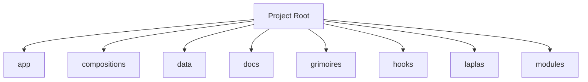

<!-- AGENT-CONTEXT
name: loa-laplas
type: framework
purpose: `loa-laplas` is the **master of ceremonies for the Loa engine**.
key_files: [CLAUDE.md, .claude/loa/CLAUDE.loa.md, .loa.config.yaml, .claude/scripts/, .claude/skills/]
interfaces:
dependencies: [git, jq, yq]
version: v0.4.0
installation_mode: submodule
trust_level: L2-verified
-->

# loa-laplas

<!-- provenance: CODE-FACTUAL -->
`loa-laplas` is the **master of ceremonies for the Loa engine**.

Built with TypeScript/JavaScript, Python, Shell.

## Key Capabilities
<!-- provenance: CODE-FACTUAL -->

### API Surface (CLI substrate — no web routes)
#### Compiler / runner
- Command — Purpose — Exit codes
- `compose-dispatch.sh <comp.yaml> --form-c` — validate → cut → emit segments + room packets + manifest — 0 ok · 1 invalid · 2 stage-fail · 3 awaiting main-loop run
- `compose-dispatch.sh <comp.yaml> [--interactive\ — --headless]` — legacy Form A/B fall-through — same
- `compose-verify-run.sh <run_id>` — proof-of-run terminal gate; verifies manifest + segments + orchestrator + content-addressed envelopes — valid_run / not_a_run
- `compose-doctor.sh` — runtime readiness check — —
- `compose-handoff-wrap.sh` — seed → validate → envelope a handoff at a seam — —
- `compose-seam-clew.sh` — capture `>>clew@<construct>: <why>` (argv/stdin, never shell-interpolated) — —
- `compose-output-schema-preflight.sh` — stage output_schema preflight — —
- `construct-adapter-gen.sh` — construct.yaml → `.claude/agents/construct-<slug>.md` — —
- `surface-envelope.sh` — pair-relay FIFO envelope surfacing — —
#### Validators (fail-closed gates)
#### Library layer
- Tool — Contract
- `lib/compose-cut.py <comp.json\ — -> --schema <p> [--validate-only] [--seam-roles]` — stdout `{ok, composition, segments, seams}`; exit 0/1/64
- `lib/segment-emitter.py --segment --composition --room-packets --cycle-id --run-id --authored-at` — emits one deterministic .workflow.js
- `lib/run-emitted-segment.js <seg> '<responsesByAgentType>' '<args>'` — dry-run harness, zero token spend
- `lib/workflow-syntax-check.js <seg>` — offline gate: no Date/Math.random in source, typed sentinel present
- `lib/construct-handoff-lib.sh compute-id` — THE hash core; envelope content-addressing

## Architecture
<!-- provenance: CODE-FACTUAL -->
The architecture follows a three-zone model: System (`.claude/`) contains framework-managed scripts and skills, State (`grimoires/`, `.beads/`) holds project-specific artifacts and memory, and App (`src/`, `lib/`) contains developer-owned application code.

Directory structure:
```
./app
./app/observatory
./compositions
./compositions/delivery
./compositions/discovery
./compositions/experimentation
./compositions/persona
./compositions/sorry-for-ur-loss
./data
./data/schemas
./data/trajectory-schemas
./docs
./docs/cycles
./docs/runtime
./grimoires
./grimoires/loa
./hooks
./hooks/subagent-start
./hooks/subagent-stop
./laplas
./laplas/bin
./laplas/lib
./laplas/schemas
./laplas/test
./modules
./modules/code-implement-and-review
./modules/fidelity-relay
./observatory
./observatory/cli
./observatory/contract
```

## Module Map
<!-- provenance: CODE-FACTUAL -->
| Module | Files | Purpose | Documentation |
|--------|-------|---------|---------------|
| `app/` | 11 | Source code | \u2014 |
| `compositions/` | 30 | Compositions | \u2014 |
| `data/` | 4 | Data | \u2014 |
| `docs/` | 7 | Documentation | \u2014 |
| `grimoires/` | 138 | Loa state and memory files | \u2014 |
| `hooks/` | 3 | Lifecycle hooks | \u2014 |
| `laplas/` | 59 | **Domain**: toolchain · **Status**: reference v0.1.0 · demo-proven (see poteau/test, | [laplas/README.md](laplas/README.md) |
| `modules/` | 8 | Modules | \u2014 |
| `observatory/` | 35 | Observatory | \u2014 |
| `poteau/` | 21 | **Domain**: enforcement · **Status**: reference-drop v0.1.0 · demo-proven | [poteau/README.md](poteau/README.md) |
| `scripts/` | 63 | Utility scripts | \u2014 |
| `skills/` | 1 | Specialized agent skills | \u2014 |
| `templates/` | 1 | Templates | \u2014 |
| `tests/` | 57 | Test suites | \u2014 |

## Verification
<!-- provenance: CODE-FACTUAL -->
- Trust Level: **L2 — CI Verified**
- 71 test files across 1 suite
- CI/CD: GitHub Actions (4 workflows)
<!-- ground-truth-meta
head_sha: 7c7d8e03196aa1c7885d34d829723209c7986f13
generated_at: 2026-06-24T17:59:47Z
generator: butterfreezone-gen v1.0.0
sections:
  agent_context: 00f819a23c4f0cd8c79c3c44b619d957cca356b180e8843a19b3383ac7cbc95b
  capabilities: fd752934ca2df5fc869ce4f06064c02f13689f7ebcb0f1397f0d4c7dab9b9df0
  architecture: f27738ea5e7fbc7c4573456b9391b54da7d73229a281da0941ade94686ef39e1
  module_map: 6dab0a9073d263ed2b4874145e5c395114081e448b070ac6ba4fe372b1cb7d41
  verification: f6526496d52b92103cc1dbd57bd222a42846313ee39a267fb986a5e9de5bfa6d
-->
