<!-- AGENT-CONTEXT: loa-laplas is the master of ceremonies for the Loa engine.
Compiles compositions (modules) into runnable, gated agentic workflows.
Primary surfaces: laplas (prepare) · poteau (enforce) · legba (custody) · observatory (render).
Enforcement: deterministic, outside the context window (exit-2 deny / Stop-block / ed25519-chained receipts / fail-closed council).
Verify by running: `node --test laplas/test/*.test.mjs` (35/35) · `bash poteau/test/run-demo.sh` (INVENTORY-pinned 32 assertions) · `node --test scripts/legba/legba.test.mjs` (17/17) · `node --test observatory/tests/{policies,share}.test.mjs` (18/18) · `node observatory/cli/verify-vectors.mjs` (5/5).
This README has been renamed in lockstep with `construct.yaml` slug and the `modules/*/quest.json` mandated-read H1 pin; see Trade-offs for the coupling.
-->

# loa-laplas

---

> la place stages the rite. the center post enforces it.
> papa legba carries across the crossroads what was proven, and refuses to open the way for what was not.

---

## What this is

`loa-laplas` is the **master of ceremonies for the Loa engine**. It takes a composition — declared as a `module` — and compiles it into a runnable, gated agentic workflow: a sequence of Claude Code workflow-segments, every construct boundary a traced, packet-emitting **room**, every prompt and tool call and turn-exit passing through a deterministic enforcement lattice before any `valid_run` is reached.

It is **substrate, not expertise**. It does not know what `artisan` does or what `k-hole` finds. It knows how to stage their rite, run it under enforcement, carry the custody chain, and render the run. It has no persona, no skills, no domain answer — it prescribes a runtime *shape* and a *law*, never a domain opinion. Its one opinion is procedural: it fails closed.

The repo became its description. It used to be a substrate that *watched* rooms. It now **prepares** a rite (`laplas`), **runs** it inside an enforcement lattice (`poteau`), **carries** custody cryptographically (`legba`), and **renders** the run as an RPG map (`observatory`).

### Why "Laplas / Poteau / Legba"?

These are not new branding. They are the next rooms of the house `loa` already named — three names deep in the same Vodou lineage, mapped onto a TTRPG vocabulary that rides parallel.

- **Laplas** — *la place*, the one who stages a Vodou rite: the master of ceremonies.
- **Poteau** — *poteau-mitan*, the center post of the peristyle through which the spirits descend.
- **Legba** — *Papa Legba*, the gatekeeper of the crossroads who must open the way before any other loa can pass.

The scholarly chain (Gibson's Sprawl trilogy → Haitian Vodou via Tallant and Deren) is derived upstream in [`loa`'s naming lineage](https://github.com/0xHoneyJar/loa#why-loa) — this repo points at it rather than re-deriving it. One layer up: `loa` is the AI entity that rides; `loa-laplas` is the rite it rides through.

```mermaid
graph LR
    subgraph Operator["The table"]
        OP["operator + module<br/><i>modules/<name>/{quest,party,dungeon}.json<br/>quest=WHAT · party=WHO · dungeon=WHERE</i>"]
    end

    subgraph Prepare["LAPLAS · la place — the three preparations"]
        LR["laplas/bin/laplas-ready.mjs<br/><i>the raid lobby: six cross-checks<br/>P601–P606 · every refusal teaches</i>"]
        RR["ready receipt<br/><i>.run/poteau/ready.json<br/>binds all three manifest hashes</i>"]
    end

    subgraph Run["The party enters the rooms"]
        PARTY["party of constructs<br/><i>.claude/agents/construct-*.md<br/>each a character, its own room</i>"]
        FORMC["scripts/compose-dispatch.sh --form-c<br/><i>cut at seams → segments + room packets</i>"]
    end

    subgraph Poteau["POTEAU · poteau-mitan — the center post (outside the context window)"]
        ARM["hooks/prompt-arm.sh<br/><i>UserPromptSubmit · arms the run</i>"]
        TG["hooks/tool-gate.sh<br/><i>PreToolUse · exit-2 deny, refusal teaches</i>"]
        MR["hooks/move-record.sh<br/><i>PostToolUse · records each move</i>"]
        XG["hooks/exit-gate.sh<br/><i>Stop · loop guard, no silent exit</i>"]
    end

    subgraph Judge["THE COUNCIL — gates judged, fail-closed"]
        GK["poteau/bin/poteau-gatekeeper.mjs<br/><i>G2 task_ref · G3 H1-echo grounding<br/>G4 ed25519 council · G5 chained receipt</i>"]
        EC["poteau/data/error-codes.json<br/><i>17 P-codes, loa E-code style</i>"]
    end

    subgraph Legba["LEGBA · papa legba — the custody chain"]
        LV["scripts/legba/legba.mjs verify<br/><i>chain · signature · span replay · receipt</i>"]
        CH["scripts/legba/legba.mjs challenge<br/><i>re-execute a move · fraud-proof</i>"]
        ANCHOR["compose-bridge.mjs verify --expect<br/><i>external anchor: catch a rebuilt chain</i>"]
    end

    subgraph Observe["OBSERVATORY — the run as an RPG map (LIVE)"]
        OBS["observatory/ · the-observatory-kappa.vercel.app<br/><i>room=span · seam=corridor · gate=door+key<br/>character=construct · enrage clock=liveness</i>"]
    end

    OP --> LR
    LR -->|"pass mints"| RR
    RR -->|"cooked ceremony runs inside"| FORMC
    FORMC --> PARTY
    PARTY -.->|"every prompt"| ARM
    PARTY -.->|"every tool call"| TG
    PARTY -.->|"every move"| MR
    PARTY -.->|"every turn-exit"| XG
    ARM --> GK
    TG --> GK
    XG --> GK
    GK -->|"refusal"| EC
    GK -->|"G5 mint, ed25519 chained"| LV
    FORMC -.->|"--legba: terminal gate<br/>verifies the chain by construction"| LV
    LV --> CH
    LV --> ANCHOR
    ANCHOR -->|"no valid_run without<br/>a verifying, anchored chain"| OBS
    MR -->|".run/audit.jsonl heartbeat"| OBS

    style OP fill:#1a1a2e,stroke:#533483,stroke-width:2px,color:#e0e0e0
    style RR fill:#1a1a2e,stroke:#533483,stroke-width:2px,color:#e0e0e0
    style PARTY fill:#1a1a2e,stroke:#533483,color:#e0e0e0
    style LR fill:#0f3460,stroke:#16c79a,color:#e0e0e0
    style FORMC fill:#0f3460,stroke:#16c79a,color:#e0e0e0
    style OBS fill:#0f3460,stroke:#16c79a,color:#e0e0e0
    style ARM fill:#1a1a2e,stroke:#e94560,color:#e0e0e0
    style TG fill:#1a1a2e,stroke:#e94560,color:#e0e0e0
    style MR fill:#1a1a2e,stroke:#e94560,color:#e0e0e0
    style XG fill:#1a1a2e,stroke:#e94560,color:#e0e0e0
    style GK fill:#1a1a2e,stroke:#e94560,stroke-width:2px,color:#e0e0e0
    style EC fill:#0f3460,stroke:#e94560,color:#e0e0e0
    style LV fill:#1a1a2e,stroke:#e94560,color:#e0e0e0
    style CH fill:#1a1a2e,stroke:#e94560,color:#e0e0e0
    style ANCHOR fill:#1a1a2e,stroke:#e94560,color:#e0e0e0
```

Read the run left to right: the operator brings a `module`, `laplas` prepares the three manifests and mints a ready receipt, a party of constructs enters the rooms, `poteau` enforces every prompt and tool call and turn-exit through the center post, the council judges the gates fail-closed, `legba` carries custody across the crossroads, and the `observatory` renders the whole run as an RPG map. The four dotted edges into the `poteau` subgraph are the thesis: in the prior README they ran into a single hook that logged and returned; here they pass through the center post and converge on `poteau-gatekeeper.mjs`, which denies (`exit-2`), blocks (`Stop` / loop guard), and fails closed (G4 council). The single watching node (`observatory`) is now downstream of enforcement, not the spine.

---

## The thesis: deterministic enforcement

This README is a **correction of the repo's own prior thesis**, not a discovery. The old thesis was observability-first: the substrate watched, and the tool-mandate hook *logged* violations without blocking them. That thesis was advisory, and advisory enforcement is a suggestion.

- **The problem:** a hook that *logs* a violation does not *prevent* it. An agent that wants to skip the governed path can, because the only consequence lives inside the context window the agent controls.
- **The solution:** `poteau` moves enforcement outside the context window. Every prompt, tool call, and turn-exit passes through the center post deterministically: `exit-2` deny, `Stop`-block, loop guard, fail-closed council, ed25519-chained receipts. **The governed path is now the cheapest path** — the agent cannot reach `valid_run` without a verifying, anchored chain.

Observability did not vanish; it was subsumed. The `observatory` renders what the lattice enforces. Three properties make the enforcement checkable:

1. **No room finishes silently.** Every room returns a typed `construct-handoff` packet — required: `construct_slug`, `output_type`, `verdict`, `invocation_mode`, `cycle_id` — gated by `handoff-validate.sh`. The exit-gate hook (`poteau/hooks/exit-gate.sh`) refuses a silent `Stop`.
2. **Stated reasoning is paired with diffable signal.** Per the [Anthropic NLA paper (2026)](https://transformer-circuits.pub/2026/nla/), a verbalized rationale can diverge from behavior, so the gatekeeper's G3 grounding check (`poteau/bin/poteau-gatekeeper.mjs`) requires the packet rationale to echo each mandated read's H1, and `evidence` carries `file:line` refs an observer can cross-check.
3. **Custody is cryptographic, not narrative.** The G5 mint is an ed25519-chained receipt (`poteau/bin/poteau-gatekeeper.mjs`, 5 ed25519 references), verified by `scripts/legba/legba.mjs verify` and re-executable by `legba.mjs challenge`.

The refusal alphabet is `poteau/data/error-codes.json` — 17 P-codes in loa's E-code style (`code` / `name` / `what` / `fix`): `P204` forbids a single-model council on a mandated council surface; `P203` fails an unproven grounding; `P500` (gatekeeper internal) fails **closed**.

---

## What this ships

| Surface | What it does | Where it lives |
|---|---|---|
| **Laplas** | The three preparations — `quest` (WHAT) · `party` (WHO) · `dungeon` (WHERE), validated together by six cross-checks `P601–P606`; a pass mints a ready receipt binding all three manifest hashes. | `laplas/bin/laplas-ready.mjs` · `laplas/README.md` |
| **Poteau** | The hook-lattice law: `prompt-arm` · `tool-gate` (`exit-2` deny) · `move-record` · `exit-gate` (`Stop` loop guard) · `compact-clew`; the exit-gate judge mints an ed25519-chained receipt; manifest→settings generator refuses drift (`P401`). Closes `#29` `#30` `#31` `#7`. **Gate honesty (v0.5.0):** the *forgeable gate* closed — custody mint + the verifier checks the receipt **signature**, not just chain structure (`#67`/`#68`); a truthful **abort** door, not a coerced "complete" (`#69`); arm-on-**entry**, not on-prompt (`#70`). | `poteau/bin/{poteau-gatekeeper,poteau-gen,reviewer-keys}.mjs` · `poteau/hooks/` (5) · `poteau/data/error-codes.json` |
| **Legba** | The custody chain: spans propose, gates validate, ed25519 tokens carry custody, a run compiles to one verifiable receipt hash. Verbs: `record · gate · verify · challenge` (challenge = fraud-proof by re-execution). Zero-dep (`node:crypto` + `node:fs`). External anchor catches a wholesale rebuild over tampered envelopes. **Custody separation (v0.5.0):** the signer daemon holds the gate key off the agent's filesystem; `verifyRun` anchors to a **root-signed trust-store**, not an in-repo key (`#59`/`#62`). | `scripts/legba/legba.mjs` · `legba-core.mjs` · `compose-bridge.mjs` · `scripts/legba/README.md` |
| **Settle** | The verify-then-proceed tier gate: a stage's earned tier is **re-derived at the gate** from the verdict, never trusted from a self-reported field (`#61`/`#72`). | `scripts/settle/settle.mjs` · `settle.test.mjs` |
| **Observatory** | The operator's design instrument, rendered as an RPG map: `room=span · seam=corridor · gate=door+key · character=construct · party=the agents · liveness=enrage clock`. MVP S1–S5 complete, deployed. | `observatory/` · `ORIENTATION.md` · `VERIFY.md` · [the-observatory-kappa.vercel.app](https://the-observatory-kappa.vercel.app) |
| Adapter generator | Produces `.claude/agents/construct-<slug>.md` from any `construct.yaml`. | `scripts/construct-adapter-gen.sh` |
| Form C compiler | validate → cut at seams → emit `.workflow.js` segments + per-stage room packets + manifest. | `scripts/compose-dispatch.sh --form-c` |
| Schemas & validators | handoff · room-activation-packet · pair-relay · construct-manifest; gated by `handoff-validate.sh` · `room-packet-validate.sh` · `construct-manifest-validate.sh`. | `data/trajectory-schemas/` · `data/schemas/` |
| Modules | Compositions reframed as TTRPG adventure modules: `{quest,party,dungeon,module}.json`. | `modules/code-implement-and-review/` · `modules/fidelity-relay/` |

**Verification is component-local, and every count here is one you can reproduce by running the command:**

| Component | Command | Result |
|---|---|---|
| Laplas | `node --test laplas/test/*.test.mjs` | `87/87` |
| Poteau (demo) | `POTEAU_SRC=$PWD/poteau bash poteau/test/run-demo.sh` | fixture demo, `poteau/test/INVENTORY.md`-pinned at `32` assertions (`ck` rows; count drift fails CI) |
| Legba | `node --test scripts/legba/legba.test.mjs` | `27/27` |
| Settle (tier gate) | `node --test scripts/settle/settle.test.mjs` | `45/45` |
| Brakes — forgeable scan | `node scripts/brakes-forgeable-scan.mjs` ; `node --test scripts/brakes-forgeable-scan.test.mjs` | `0` candidates (exit 0) · `3/3` |
| Brakes — grounded scan | `node scripts/grounded-scan.mjs` ; `node --test scripts/grounded-scan.test.mjs` | `0` ungrounded (exit 0) · `3/3` |
| Brakes — jcs drift guard | `node --test scripts/legba/jcs-boundary.test.mjs` | `3/3` |
| Brakes — trust-root proof | `node --test scripts/trust-root-proof.test.mjs` | `1/1` |
| Poteau — security · exit · fuzz | `node --test poteau/bin/poteau-gatekeeper.{security,honest-exit,fuzz}.test.mjs` | `5/5` · `4/4` · `3/3` |
| Brakes — immune CI | `.github/workflows/brakes-immune.yml` | all 4 gate-honesty axes, green on every push |
| Observatory | `node --test observatory/tests/policies.test.mjs observatory/tests/share.test.mjs` | `18/18` |
| Observatory veve | `node observatory/cli/verify-vectors.mjs` | `5/5` byte-match |
| Observatory selftest | `node observatory/cli/obs.mjs selftest` | contract wall fires (S1) |

> The old README's "115 `@test` across 8 suites" was the Form-C bats era only and is retired — the verification story is now multi-component and re-counted per surface above.

---

## The glossary

The Vodou root and the TTRPG role for each surface, read from the component READMEs and `poteau/data/error-codes.json`.

| Term | Vodou root | TTRPG role | What it IS in the repo |
|---|---|---|---|
| **Laplas** | *la place* — the one who stages the rite | master of ceremonies / the raid lobby | `quest` · `party` · `dungeon` prepared separately, validated together; six cross-checks `P601–P606`; a pass mints a ready receipt binding three manifest hashes. |
| — the six cross-checks | — | the lobby's ready-check | `P601` party_missing_role · `P602` dungeon_missing_tool · `P603` council_understaffed · `P604` gate_room_unreachable · `P605` rel_mismatch · `P606` hitl_slot_unseated. (`P600` = module/manifest unreadable.) |
| **Poteau** | *poteau-mitan* — the center post of the peristyle | the enforcement lattice / the law | Every prompt, tool call, turn-exit passes the post deterministically, outside the context window. `poteau-gatekeeper.mjs` is the exit-gate judge; `poteau-gen.mjs` refuses drift (`P401`); 5 hooks. |
| — P-codes | — | the refusal alphabet | `P101`/`P102` packet · `P201`/`P202` task_ref · `P203` grounding_unproven · `P204` council_downgraded · `P301` unhonorable_mandate · `P401` generated_file_drift · `P402` protected_path_mutation · `P500` gatekeeper_internal (fails closed). |
| **Legba** | *Papa Legba* — gatekeeper of the crossroads | the custody chain | Cryptographic validation of state transitions, file-backed, zero-dep. ed25519 tokens carry custody; a run compiles to one verifiable receipt hash. `compose-dispatch.sh --form-c --legba` bakes the verify into the terminal gate. |
| **Observatory** | — (TTRPG-native, no Vodou name) | the RPG map / the spectator lens | Renders structure already there as an RPG map; S1–S5 complete, deployed. Proof = `obs selftest` + veve byte-pinned vectors + node tests. |
| — veve | *vèvè* — the drawn ritual sigil | golden master / the byte-pin | Byte-pinned golden vectors that must byte-match (`verify-vectors.mjs`, `5/5`). |
| **Modules** | — (TTRPG adventure module) | the published adventure | Compositions as adventure modules: `modules/<name>/{quest,party,dungeon,module}.json`; `module.json` references the three manifests by path. |

> The doctrine line the components both carry: *the governed path is now the cheapest path* — an agent cannot reach `valid_run` without a verifying, anchored chain.

---

## Modules

A composition is a **module**: three manifests prepared separately and validated together.

| File | Holds |
|---|---|
| `quest.json` | WHAT — the work, plus `mandated_reads` (each pinned to a README `h1` the grounding gate echoes). |
| `party.json` | WHO — per-seat tiers (`role` · `seat` · `tier` · `kind`) and `review_routing`. |
| `dungeon.json` | WHERE — the rooms, tools, and gate topology the party traverses. |
| `module.json` | the binding — references the three manifests by path (Laplas's tri-manifest input). |

Two modules ship today: `modules/code-implement-and-review/` and `modules/fidelity-relay/`. The cost lever now lives in the `party.json` manifest as honest tier declarations: in `code-implement-and-review`, the `implementer` is a `sonnet` work-seat fanned out into parallel leaves at dispatch, and the `reviewer` is a single `opus` craft-gate firing once on the merged diff at the seam (`review_routing.council=false`). No work seat runs opus.

---

## The runtime: Form C

Form C is one belt inside the larger ceremony — the **executor** that runs a prepared module. A composition is not one workflow; it is a chain of workflow-segments cut at gate seams.

| Role | Who | What |
|---|---|---|
| **Compiler** | `compose-dispatch.sh --form-c` (bash) | validate (offline, before spend) → cut at seams → emit `.workflow.js` segments + per-stage room packets + a run manifest. Emitted JS cannot touch the filesystem. |
| **Executor** | the CC main loop | run each segment via `Workflow({scriptPath, args})`; wrap and validate its handoffs; run the seam protocol (`AskUserQuestion` + clew capture) between segments; fire the next segment with explicit JSON. |

A stage is a seam when `stage.mode == "blocking"`, or `stage.role in {hard-stop, craft-gate, gate}`, or `stage.hitl_by_nature == true`. **N seams → up to N+1 segments.** The seam protocol cannot live inside a workflow (a CC workflow run takes no mid-run human input), so every human decision point is a workflow boundary. Clew fires only at a seam — a composition with no gate gathers zero learnings by construction. Form A/B are the legacy fall-through, retired once the loom ribbon re-points at `/workflows`.

> Authority for the seam protocol: `docs/compose-as-cc-workflow.md`.

---

## Boundaries (what this is NOT)

| It is NOT… | Because |
|---|---|
| **OS-level isolation** | `poteau` is a deterministic policy lattice outside the context window: it denies (`exit-2`), blocks (`Stop` / loop guard), and fails closed (`P500`). It is still **not** process isolation — no cgroups, no chroot, no capability dropping, no process sandbox. It governs the agent's moves through Claude Code's hook surface, not the kernel. |
| **a non-Claude-Code runtime** | Targets the `.claude/agents/*.md` registry only — not the OpenAI Agent SDK, the Anthropic API direct, local LLM frontends, or custom orchestrators. The runtime-agnostic part is the `construct-handoff` packet schema, not the adapter. |
| **a redefinition of construct identity** | `construct.yaml` is identity, `identity/<PERSONA>.md` is persona, `skills/<slug>/SKILL.md` are skills. The substrate reads only `tools.{allowlist,denylist,required}` + `adapter.{…}` from the manifest. |
| **a replacement for Loa's L1–L5** | It complements the framework's in-session construct support; it does not replace it. Different operators want different runtimes. |
| **its own embodied construct** | The manifest declares its own emptiness (`type: skill-pack`, `personas: []`, `skills: []`). It is an installable runtime, but there is nothing to embody. Mechanism, not voice. |

---

## Responsibilities

| Concern | Owner |
|---|---|
| What a construct *knows / does* (persona, skills, taste) | the construct's own pack |
| **Preparation** (the tri-manifest ready-check) | **Laplas** |
| **Enforcement** (the hook lattice, fail-closed council) | **Poteau** |
| **Custody** (the ed25519 chain, fraud-proof challenge) | **Legba** |
| **Render** (the run as an RPG map) | **Observatory** |
| How a construct is *invoked, traced, composed* (rooms, packets, Form C) | **this pack** |
| Which *model* a construct runs on | Hounfour routing — **not** this pack (the module's `party.json` declares per-seat tiers; Hounfour finalizes) |
| The composition *bridge schema* | the host (`loa-constructs`); the substrate only reads it |
| Cross-construct + cross-runtime concerns | the Loa framework |

---

## Runtime target

Claude Code **v2.1.0+** loads project agents at `.claude/agents/<name>.md` into the registry and surfaces them via `@`-mention typeahead — the floor for the room machinery.

The hook-as-law contract has a **newer floor**: Poteau's S1.1 freeze gate proved the five hook-contract legs (`Stop`-block · `exit-2` deny · loop guard · injection-delivery · combined) on **CC 2.1.176** (`docs/poteau-runbook.md`). State both: rooms need v2.1.0+; the enforcement lattice is proven from 2.1.176.

---

## Trade-offs (honest version)

**The bet:** deterministic enforcement is worth the lattice complexity — five hooks, an ed25519 custody chain, a fail-closed council, an external anchor.

**The costs:**
- More moving parts than an advisory hook: a compile step before every run, plus a custody chain to verify.
- An opinionated runtime shape (segments cut at seams), even though the substrate holds no domain opinion.
- **`legba`'s schema is PROVISIONAL.** The `SpanMove` / `GateToken` / `RunReceipt` shapes track [`loa-hounfour#118`](https://github.com/0xHoneyJar/loa-hounfour/pull/118); the validator implementations land post-merge (`scripts/legba/README.md`).
- **Still not OS-level isolation.** Enforcement is deterministic and outside the context window, but it is hook-surface governance, not a process sandbox.

**The coupled rename (disclosed, not hidden).** This README's H1 flipped to `# loa-laplas` together with two manifest pins it is wired to:
- `construct.yaml` (`slug` / `name` / `version` / `repository.url`) — System-Zone manifest realignment, applied as deterministic edits alongside this README, not by prose.
- `modules/code-implement-and-review/quest.json` `mandated_reads[0].h1` — pinned to the README H1 that `poteau`'s own G3 grounding check echoes. Flipping the README H1 without this pin would arm a self-inflicted `P203` grounding failure: the enforcement lattice this README celebrates would refuse the very rename it documents. The two are renamed in lockstep in this change.

**The alternative** — staying L1–L5-only — costs you the visible spawn surface, the typed handoff, the enforcement lattice, and the clew loop, but carries none of the above machinery. This pack is one runtime; the framework's L1–L5 is another. Neither is wrong.

---

## Status & origin

- Repo: `0xHoneyJar/loa-laplas`, né `construct-rooms-substrate`.
- Landmark merges: **PR #43** — Observatory Graduation (S1–S5 complete, deployed at [the-observatory-kappa.vercel.app](https://the-observatory-kappa.vercel.app)); **PR #44** — Laplas + Poteau, the enforcement lattice (advisory enforcement becomes deterministic). Legba custody series: **#37–#39**.
- The rename is **completed across the README and the coupled manifests in this change** (`construct.yaml` slug/name/version + the `quest.json` mandated-read H1 pin), with the version bumped past `0.3.0`. The README and the manifests no longer disagree on the repo's own name.
- Authored as the deliverable of `cycle-053`; the runtime, adapters, and component tooling are this repo's own source, edited directly here. The composition bridge schema stays host-side in `loa-constructs`. Originating brief / PRD / SDD remain local-only under `grimoires/` (activation receipt required before treating them as doctrine).

---

## See also

- `laplas/README.md` — the three preparations and the six cross-checks
- `poteau/README.md` — the center post, the hook lattice, the gatekeeper
- `poteau/data/error-codes.json` — the 17 P-codes (the refusal alphabet)
- `scripts/legba/README.md` — the custody chain (PROVISIONAL schema, tracks `loa-hounfour#118`)
- `observatory/ORIENTATION.md` · `observatory/VERIFY.md` — the RPG mapping and the mechanical gates
- `docs/poteau-runbook.md` — the hook-as-law contract, proven on CC 2.1.176
- `docs/compose-as-cc-workflow.md` — Form C runtime + seam-protocol authority

---

## License

AGPL-3.0.

---

*Ridden with [Loa](https://github.com/0xHoneyJar/loa) · custody carried by `legba`, the way opened only for what verifies.*