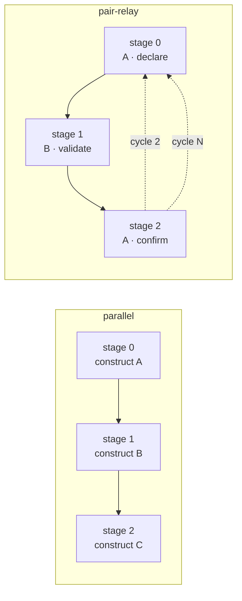

# Composition patterns

`construct-rooms-substrate` supports two composition patterns. They share the same handoff-packet contract but differ in how stages are traversed and how the orchestrator interprets stage outputs.

| Aspect | `parallel` (v0.1.0) | `pair-relay` (v0.2.0) |
|---|---|---|
| Composition field | `chain[]` | `sequence[]` |
| Walk shape | One pass, stage 0 → N−1 | Up to `max_cycles` walks of the sequence |
| Same-construct stages | Discouraged | Encouraged — relays often revisit the same construct |
| Envelope surfacing | Implicit (stage_exit log only) | Per stage via `surface-envelope.sh` (silent / summary / interactive) |
| Operator pair-points | One paste per stage in interactive mode | One paste per stage per cycle in interactive mode; FIFO + WAITING-OPERATOR side-channel in `interactive` surface mode |
| Convergence | Defined by completion of last stage | Defined by `convergence_criteria` text + final-cycle operator verdict |
| State machine | `INIT → COMPOSITION_VALIDATE → STAGE_LOOP → DONE` | `INIT → COMPOSITION_VALIDATE → RELAY_LOOP → DONE` (with per-cycle `ROOM_ACTIVATE → DISPATCH → HANDOFF_VALIDATE → ENVELOPE_WRITE → ENVELOPE_SURFACE`) |
| Bookkeeping | `<run_dir>/orchestrator.jsonl` | `<run_dir>/orchestrator.jsonl` + `<run_dir>/relay-state.json` |

## When to reach for which

Use `parallel` when:
- Stages run once each and don't loop back
- Each construct's stage builds on the previous stage's output but the chain is feed-forward
- Existing v0.1.0 compositions you don't want to migrate

Use `pair-relay` when:
- Two (or more) constructs need to bounce a verdict back and forth — A inscribes intent, B inspects, A confirms or revises
- Convergence is operator-judged rather than mechanically derived
- You want the operator to see each round-trip envelope and have a clean checkpoint to step in (`surface_mode: interactive`)



## Pair-relay descriptor

`data/trajectory-schemas/pair-relay-composition.schema.json` is the source of truth. The validator at `scripts/pair-relay-validate.sh` enforces both the JSON Schema rules (required fields, regex patterns, enums) and the cross-field semantic rule `max_cycles >= sequence.length`.

A complete descriptor:

```yaml
schema_version: 1
pattern: pair-relay
artifact_name: fidelity-audit-verdict
sequence:
  - construct: artisan
    role: declare-taste
    persona: ALEXANDER
  - construct: crucible
    role: validate-shipped
    persona: null
  - construct: artisan
    role: confirm-intent
    persona: ALEXANDER
max_cycles: 3
surface_mode: summary
domain: fidelity
convergence_criteria: >
  Operator accepts artisan's final-cycle verdict; diff between declared and
  shipped is either acknowledged-as-intentional or accepted-as-fix-required.
```

Field reference:

- `pattern` — must be `pair-relay` for this branch (see `parallel` docs for v0.1.0 compositions).
- `artifact_name` — slug for the artifact this composition produces. Used in envelope filenames + orchestrator logs.
- `sequence[]` — ordered stages. Minimum 2 entries. The same construct slug may repeat — that's the whole point.
- `sequence[].construct` — Loa construct slug. Resolved via `construct-resolve.sh` at validate time unless `--no-resolve` is passed.
- `sequence[].role` — slug-form role label surfaced in envelope summaries.
- `sequence[].persona` — optional canonical persona name (e.g. `ALEXANDER`, `LYNCH`); `null` when none.
- `max_cycles` — integer 1–6 (default 2). Cross-field: must be ≥ `sequence.length`.
- `surface_mode` — `silent` / `summary` / `interactive`. See "Envelope surfacing" below.
- `convergence_criteria` — human-readable convergence definition (nullable, ≤1024 chars). The operator uses this prompt at interactive checkpoints.
- `domain` — optional slug tag (`fidelity`, `accessibility`, `frame`, …) for cross-composition analysis.

## Authoring walkthrough — `fidelity-relay`

The walkthrough below assumes you're writing a brand-new pair-relay composition for a fidelity audit (ALEXANDER ↔ crucible ↔ ALEXANDER). It mirrors how `compositions/fidelity-relay.yaml` will ship in Sprint 3.

1. **Name the artifact** — what verdict comes out at convergence? For fidelity audits, that's the operator-accepted *fidelity-audit-verdict* per lane.

2. **Lay out the sequence** — relays always start and end with the same construct in a "declare → inspect → confirm" rhythm. Three stages is the canonical fidelity shape; the access lane uses three too (kansei ↔ artisan ↔ kansei). Frame uses three (rosenzu ↔ artisan ↔ rosenzu).

3. **Choose `max_cycles`** — for an audit, 3 is typical: one cycle to surface the diff, one to refine, one to converge. The cross-field rule requires `max_cycles >= sequence.length`. Cap at 6 to avoid drift.

4. **Pick `surface_mode`**:
   - `silent` — the relay logs envelopes but emits no stderr; use for batch / CI runs where you only consult the orchestrator log later.
   - `summary` — default. Each envelope produces a ≤24-line ≤80-col stderr summary. Drawn only from envelope fields named in SDD §2.1.3 (`construct_slug`, `persona`, `verdict`, `why.rationale`, `why.decisions_considered`, `why.tools_used`).
   - `interactive` — adds a FIFO-blocking wait at `<run_dir>/.relay-control.fifo` after each stage. Triggers the `WAITING-OPERATOR` side-channel signal (preserves the BR-CRAFT-005 remediation). Use when you want a step-by-step operator checkpoint.

5. **Write the `convergence_criteria` paragraph** — operator-readable, no jargon. This text surfaces at interactive checkpoints as "is this run done yet?" framing.

6. **Validate before running** — `scripts/pair-relay-validate.sh <path>` should exit 0. Exit 1 means a schema violation; exit 2 means a semantic violation (cross-field rule or unresolvable slug).

## Envelope surfacing

`scripts/surface-envelope.sh` is the per-stage surfacing primitive. It writes an `envelope.surfaced` row to `<run_dir>/orchestrator.jsonl` and, depending on the mode, may also emit a stderr summary or block on a FIFO.

The `interactive` mode contract:

- Opens the FIFO read-write in-process so `open()` doesn't block waiting for a writer.
- Writes a `WAITING-OPERATOR` flag file inside `<run_dir>/` and appends `envelope.waiting-on-operator` to `<state_root>/waiting-on-operator.jsonl` (the cross-run aggregator).
- Waits up to `LOA_SURFACE_ENVELOPE_FIFO_TIMEOUT_SECONDS` (default 1800; overridable per-invocation via `--timeout`).
- On FIFO read or timeout: removes the flag + FIFO, appends `envelope.operator-responded`, returns 0 (read) or 2 (timeout).

`compose-dispatch.sh` invokes `surface-envelope.sh` after each handoff-validate succeeds. Timeouts there are *not* fatal — the orchestrator logs `envelope.surface_failed` and proceeds to the next stage. The pair-relay run can therefore degrade gracefully (operator stepped away) without breaking the relay state machine.

## Extension points

The pair-relay design is intentionally narrow in v0.2.0. The extension points you'll most likely reach for next:

- **Three-construct relays** — the schema already accepts arbitrary sequence shapes (e.g. `kansei → crucible → kansei`). Just add the stages.
- **Custom roles** — `role` is a free slug. Add a vocabulary that names the *function* of each stage in the relay (`declare-taste`, `validate-shipped`, `confirm-intent`, …) so envelope summaries read like a story rather than a stack trace.
- **Headless dispatch** — Sprint 4 of this cycle's downstream substrate work is expected to land the `claude -p` dispatch path so CI / audit pipelines can run a full relay without operator pastes. Until then, treat `--headless` as a stub that requires `--inject-handoff` (test mode) or a pre-staged handoff packet.
- **Convergence detection** — `convergence_criteria` is operator-judged today. A future cycle could introduce a `convergence_check_script` field that mechanically reads the final-cycle envelope and returns a boolean.

## Reference paths

| Path | What it is |
|---|---|
| `data/trajectory-schemas/pair-relay-composition.schema.json` | JSON Schema (Draft 2020-12) for the composition descriptor |
| `scripts/pair-relay-validate.sh` | Validator (schema + cross-field semantic rules) |
| `scripts/surface-envelope.sh` | Per-stage envelope surfacing (silent / summary / interactive) |
| `scripts/compose-dispatch.sh` | Composition runner; routes `pattern: pair-relay` into RELAY_LOOP |
| `tests/fixtures/pair-relay/valid/` | Reference-shape composition fixtures (minimal, fidelity, access, frame) |
| `tests/fixtures/pair-relay/invalid/` | Negative fixtures, one per validation rule |
| `tests/integration/pair-relay-validate.bats` | Validator integration tests (20 cases) |
| `tests/integration/surface-envelope.bats` | Surface-envelope integration tests (14 cases) |
| `tests/integration/pair-relay-orchestrator.bats` | End-to-end RELAY_LOOP integration tests (12 cases) |
