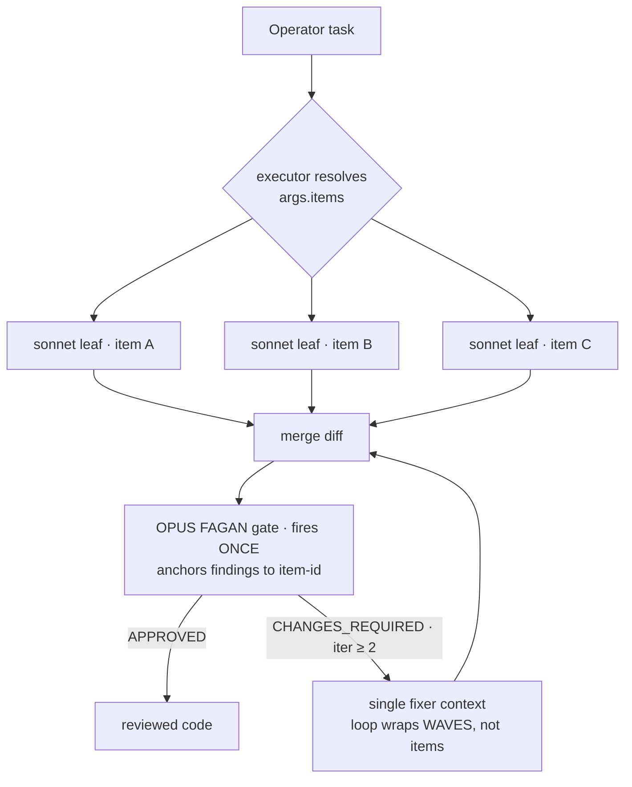

# Sprint Plan — `code-implement-and-review` SPEED redesign

**Version:** 1.0
**Date:** 2026-06-13
**Author:** Sprint Planner Agent (planning-sprints skill)
**Branch context:** authored on `cycle/laplas-poteau` — **but this is a SEPARATE concern**
**PRD Reference:** *none — see "Grounding & Provenance" below*
**SDD Reference:** *none — runtime mechanism is already shipped; see verification table*

---

## Grounding & Provenance (READ FIRST)

> **No PRD/SDD grounds this work.** The laplas-poteau cycle's
> `grimoires/loa/{prd,sdd,sprint}.md` are about ENFORCEMENT (#7, #29, #30, #31) —
> a different, complete, committed concern. This plan does **not** touch those
> artifacts. Per the planning-sprints uncertainty protocol, the operator's
> direction (verbatim below) is treated as the crystallized requirements.

**Operator's direction (the spec):**
> Make `code-implement-and-review` FAST. It currently runs as one SEQUENTIAL
> work→FAGAN-gate chain that iterates up to 3× with an opus reviewer each loop —
> too slow, too expensive. Split the work into independent tasks, parallelize
> them across cheap-tier (sonnet) agents, and reserve opus for the craft-gate,
> which should fire ONCE at the seam instead of looping. Rethink the
> party/quest/dungeon tri-manifest: who to bring in as agents, and how the
> dungeon expresses the parallel fan-out.

**The load-bearing insight (verified against runtime, not assumed):** the SPEED
machinery the operator wants **already exists at the runtime level**. The gap is
**entirely at the module/composition declaration + executor-instruction layer.**
This sprint closes that gap; it writes **no runtime code**.

| Runtime capability (already shipped) | Source (verified) |
|---|---|
| DAG-parallel fan-out via `args.items = [{id, task, depends_on?, intelligence_tier?, isolation?}]` | `scripts/lib/segment-emitter.py:943-953` (RFC #35) |
| Wave scheduling — Kahn layers over `depends_on`, dispatched through `boundedParallel` (8-wide chunks) | `segment-emitter.py:1051-1070, 1125-1145` |
| Leaves default to **cheap ≡ sonnet** unless the item declares its own tier | `segment-emitter.py:1109` (`leafModel = TIER_MODEL_JS[it.intelligence_tier] \|\| "sonnet"`) |
| **Iterations ≥ 2 stay the single fixer context — the loop wraps WAVES, not items, so review cost does NOT multiply.** The gate reviews MERGED output, anchors findings to `[item-id]`. | `segment-emitter.py:947-948`; `docs/compose-as-cc-workflow.md:204-212` |
| DAG fan-out requires **exactly ONE work stage** in the iterate pair (`dag_capable = len(work_stages) == 1`) — the current composition has exactly that (stage 1 implement, stage 2 review) | `segment-emitter.py:953` |
| RFC #35 spec + "do NOT auto-migrate" contrast cases | `docs/compose-as-cc-workflow.md:184-230` |
| `laplas/schemas/{party,quest,dungeon}.schema.json` exist and gate the manifests; party member `tier` enum = `opus\|sonnet\|haiku\|fable\|external`; top-level + member objects are `additionalProperties: true` (so a fan-out field is addable without a schema bump) | `laplas/schemas/party.schema.json:22`, `quest.schema.json` |

**What this means:** the runtime can already fan out cheap workers in waves and
gate once. Today's composition never tells it to. The fix is: (1) declare the
fan-out + tiering in the tri-manifest, (2) instruct the executor (the `/compose`
driver) to resolve task topology into `args.items[]` at invocation, (3) re-staff
the party so workers are sonnet and only the gate is opus.

**Citations that anchor the current (slow) shape:**
- `compositions/code-implement-and-review.yaml:68-69` — `iterate: [[1, 2]]`
- `…:76` — `max_iterations: 3` (the loop the opus gate rides)
- `…:90` — stage 1 implementer = `general-purpose` (one serial context)
- `…:109-119` — stage 2 = `fagan`, `thinking_effort: high`, no tier declared → defaults to DEEP→opus by role
- `modules/code-implement-and-review/party.json:6` — implementer staffed at `"tier": "opus"` (the cost mistake: workers should be sonnet)
- `modules/code-implement-and-review/dungeon.json:5-8` — two flat rooms (`implement`, `review`), no fan-out expression

---

## Executive Summary

Convert `code-implement-and-review` from **one serial mega-context that loops an
opus gate up to 3×** into **a parallel cheap-tier fan-out that gates once at the
seam**. The redesign is the tri-manifest (`modules/code-implement-and-review/{quest,party,dungeon}.json`)
plus the composition (`compositions/code-implement-and-review.yaml`) — **no runtime
code**. The target shape, in the runtime's own vocabulary:

```
ITERATION 1:  fan out work → N sonnet leaves in Kahn waves (boundedParallel)
THE SEAM:     one opus FAGAN gate reviews the MERGED diff, anchors findings to [item-id]
ITERATIONS ≥ 2 (only if CHANGES_REQUIRED):  single fixer context applies fixes; gate re-reads
```

Because the convergence loop **wraps waves, not items**, the opus gate cost is
~1× per cycle regardless of how many work items fan out — the inverse of today,
where a single serial implementer feeds an opus gate that re-runs the whole
review up to 3×.

**Total Sprints:** 3 (MVP = S1–S2 · validation = S3)
**Sprint Duration:** ~2.5 days each (nominal)
**Scope discipline:** SPEED only. Three friction findings from today's live
re-drive (false-positive council arming on a no-segment session · no truthful
agent-side `verdict: aborted` abort path · exit-gate refusal message citing flat
`.run/poteau/packet.json` vs the run-scoped carve-out) are **OUT OF SCOPE** — noted
for a separate follow-up, NOT in this plan.

---

## Goals (crystallized from operator direction)

| ID | Goal | Metric (named, testable) |
|----|------|--------------------------|
| **G-1** | **Work fans out, cheaply** | An armed run of the redesigned module dispatches independent work items as ≥2 parallel sonnet leaves in ≥1 Kahn wave (visible in `orchestrator.jsonl` as a `DAG wave 1/N` log line); leaves carry `model: "sonnet"`, NOT opus — verified in the emitted `.run/compose/<run>/workflows/*.workflow.js` |
| **G-2** | **The gate fires ONCE at the seam, on merit** | The opus FAGAN gate reviews the MERGED output exactly once per convergence cycle (not once per item); on a clean first pass the composition completes with **one** gate invocation; iteration count in `fagan-trail.jsonl` reflects waves, not items |
| **G-3** | **Opus is reserved for the gate** | The party staffs every worker seat at `sonnet` and only the craft-gate (+ any council seat that must reason at gate-depth) at `opus`; a tier audit of `party.json` shows no opus on a `seat: work` member |
| **G-4** | **The dungeon expresses the fan-out** | `dungeon.json` declares the parallel topology (a fan-out room + a merge/gate seam) such that a reader can see "many workers → one gate" from the manifest alone; `laplas-ready` still passes (no schema break) |
| **G-5** | **Cost drops, provably, with no quality loss** | An A/B drive (old vs new shape on the same multi-item task) shows the new shape costs materially less (target: gate-token spend ~1×/cycle vs up-to-3× before; worker tokens at sonnet rates) AND the FAGAN gate still surfaces the same class of real defects — measured, not asserted |

---

## Sprint Overview

| Sprint | Theme | Key Deliverables | Dependencies |
|--------|-------|------------------|--------------|
| 1 | **THE FAN-OUT MANIFEST** — re-author the tri-manifest for parallel cheap workers + a single opus seam | redesigned `quest.json`, `party.json`, `dungeon.json`; `laplas-ready` green | None |
| 2 | **THE EXECUTOR WIRING** — make the composition + `/compose` driver actually pass `args.items[]` and route the gate once | updated `code-implement-and-review.yaml`; emitted workflow proven to fan out at sonnet + gate once at opus | Sprint 1 |
| 3 | **PROVE THE SPEEDUP** — A/B the old vs new shape; E2E goal validation | benchmark report; all goals G-1…G-5 validated on a live drive | Sprint 2 |

---

## Sprint 1: THE FAN-OUT MANIFEST — size MEDIUM (4 tasks)

**Duration:** ~2.5 days

### Sprint Goal
Re-author the `code-implement-and-review` tri-manifest so the WHO (party), the
WHAT (quest), and the WHERE (dungeon) all express *parallel cheap workers + one
opus seam* — while staying valid against the frozen laplas schemas.

### Deliverables
- [ ] `modules/code-implement-and-review/party.json` re-staffed: workers `sonnet`, gate `opus`
- [ ] `modules/code-implement-and-review/quest.json` updated: objectives + gate contract reflect fan-out-then-gate-once; `review_routing` honest about the single-gate seam
- [ ] `modules/code-implement-and-review/dungeon.json` updated: a fan-out room + a merge/gate seam room, with budgets sized for parallel leaves
- [ ] `laplas-ready` passes on the redesigned trio (receipt binds all three hashes)

### Acceptance Criteria
- [ ] `node laplas/bin/laplas-ready.mjs --module modules/code-implement-and-review` returns a PASS + mints a ready receipt binding quest/party/dungeon hashes (P601–P606 all green)
- [ ] No `seat: work` member in `party.json` carries `tier: opus` (tier audit: `jq '.members[] | select(.seat=="work") | .tier' party.json` → no `opus`)
- [ ] `party.json` validates against `laplas/schemas/party.schema.json`; `quest.json` against `quest.schema.json`; `dungeon.json` against `dungeon.schema.json` (all `additionalProperties` extensions stay within the `true`-typed objects)
- [ ] The opus gate seat is preserved (FAGAN craft-gate remains `opus`); the HITL operator slot is preserved

### Technical Tasks

> Annotated with contributing goal(s).

- [ ] **Task 1.1**: Re-staff `party.json` — flip the implementer/worker seats to `tier: "sonnet"`; keep the FAGAN `craft-gate` reviewer at `tier: "opus"`; keep the `operator` HITL slot. Update the `_note` field to describe the fan-out-of-sonnet-workers + one-opus-gate intent honestly (the current `_note` describes the old single-voice-FAGAN shape).
  > From `party.json:6`: implementer currently `"tier": "opus"` — the cost mistake to fix.
  → **[G-1, G-3]**
- [ ] **Task 1.2**: Update `quest.json` — rewrite `objectives` to state the parallel-decompose-then-gate-once intent; keep gate contract (`craft-gate` → `fagan`/`reviewing-diffs`) and the `operator-seam` HITL gate; reconcile `review_routing` with the SINGLE-gate reality (the gate fires once on merged output — decide explicitly whether `council: true / min_voices: 2` still applies or is dropped, and record the decision inline). Objectives stay ≤4000 chars, no backtick runs (schema T5/U1).
  > From `quest.json:7-8` + `:13`: objectives + `review_routing.council:true, min_voices:2`.
  → **[G-2, G-4]**
- [ ] **Task 1.3**: Redesign `dungeon.json` — replace the two flat rooms (`implement`, `review`) with a topology that expresses fan-out: a `fan-out`/`work` room (where the wave of sonnet leaves runs) and a `gate`/`merge-and-review` seam room (where the single opus gate reads merged output). Size `budgets` for parallel leaves (the current flat `tool_calls: 50, wall_s: 600` assumes one serial context — parallel leaves need per-leaf or wave-aware budgets). Keep `rel: competitive` and `tools: [codex]` consistent with the quest.
  > From `dungeon.json:5-9`: `rooms: [{implement},{review}]`, `budgets:{tool_calls:50,wall_s:600,stall_s:120}`.
  → **[G-4]**
- [ ] **Task 1.4**: Run `laplas-ready` against the redesigned module; fix any P601–P606 mismatch the redesign introduces (e.g. role/seat/gate cross-validation); record the green receipt path in `grimoires/loa/NOTES.md`.
  > Validates the trio coheres before the composition wiring depends on it.
  → **[G-1, G-2, G-3, G-4]**

### Dependencies
- None (first sprint). Depends only on the already-shipped laplas schemas (`laplas/schemas/*.schema.json`) and `laplas-ready.mjs`.

### Security Considerations
- **Trust boundaries**: quest `objectives` are task literals baked into work + gate prompts — the schema bound (≤4000 chars, no backtick runs, T5/U1) must hold; do not loosen it.
- **External dependencies**: none added — manifests are data, not code.
- **Sensitive data**: none.

### Risks & Mitigation
| Risk | Probability | Impact | Mitigation |
|------|-------------|--------|------------|
| `review_routing.council: true` (quest) conflicts with the "gate fires once" intent → ambiguous semantics | Med | Med | Task 1.2 forces an EXPLICIT decision recorded inline; do not leave council semantics implicit |
| Dungeon budget redesign starves or over-feeds parallel leaves | Med | Med | Size budgets per-wave with a stated assumption; tune in S3 against the live A/B |
| Re-staffing breaks a `laplas-ready` cross-validation (P603 council-staffable, P605 REL-compatible) | Med | Low | Task 1.4 is the catch; iterate within the sprint until green |

### Success Metrics
- `laplas-ready` PASS on the redesigned module (1/1)
- 0 opus-tier `seat: work` members (tier audit)
- 3/3 manifests schema-valid

---

## Sprint 2: THE EXECUTOR WIRING — size MEDIUM (4 tasks)

**Duration:** ~2.5 days

### Sprint Goal
Make the composition + the `/compose` driver actually USE the runtime's RFC #35
fan-out: the executor resolves the task into `args.items[]`, leaves run at sonnet,
and the opus gate fires once on the merged output.

### Deliverables
- [ ] `compositions/code-implement-and-review.yaml` updated: documents + declares the fan-out shape; stage tiering corrected (implementer not opus-pinned; gate opus)
- [ ] The `/compose` driver instructed (via the composition's own contract/notes) to resolve task topology into `args.items[]` at invocation (the emitter "never shells out to br" — the executor populates items)
- [ ] An emitted `.run/compose/<run>/workflows/code-implement-and-review.segment-1.workflow.js` proven to carry the DAG machinery with sonnet leaves
- [ ] The composition still single-context-runs a task with NO `items[]` (backward-compatible — fan-out is opt-in per RFC #35)

### Acceptance Criteria
- [ ] When the executor passes `args.items[]` with ≥2 independent items, the emitted workflow logs `DAG mode: N item(s) in M wave(s)` and `DAG wave 1/M` (per `segment-emitter.py:1057, 1064`)
- [ ] Each leaf in the emitted workflow resolves `model: "sonnet"` (no explicit per-item tier → `leafModel` default), confirmed by reading the emitted `.workflow.js`
- [ ] The FAGAN gate stage emits with opus routing (stage tier DEEP→opus by role, or explicit) and fires ONCE per convergence cycle on the merged diff
- [ ] A task with NO `items[]` still runs the single-context implement→gate path unchanged (no regression for simple tasks)
- [ ] `terminate_when` / `max_iterations` semantics preserved: convergence loop wraps WAVES; iterations ≥ 2 stay the single fixer context (`segment-emitter.py:947-948`)

### Technical Tasks

- [ ] **Task 2.1**: Update `code-implement-and-review.yaml` — add a documented section (mirroring `docs/compose-as-cc-workflow.md:184-212`) declaring that this composition is RFC-#35-capable (exactly one work stage in the `iterate` pair, which it already satisfies); state that the executor SHOULD resolve independent sub-tasks into `args.items[]`; correct the implementer stage so it is NOT opus-pinned (let it default to the leaf path / sonnet) while the FAGAN gate stays opus.
  > From `…yaml:68-69, 76, 90, 109-119`: `iterate:[[1,2]]`, `max_iterations:3`, stage 1 `general-purpose`, stage 2 `fagan` high-effort.
  → **[G-1, G-2, G-3]**
- [ ] **Task 2.2**: Wire the executor instruction — the `/compose` skill drives the run; ensure the composition's `notes`/`operator_note` + the module contract make it unambiguous that the driver enumerates independent items into `items[]` (and how it derives them: from the operator task, a sprint plan, or beads epic edges, per RFC #35). The emitter stays deterministic; the EXECUTOR populates `items`. Capture the exact invocation shape as an `invocation_example`.
  > From `segment-emitter.py:949-950`: "the executor resolves … topology to items[]; the emitter … never shells out to br."
  → **[G-1]**
- [ ] **Task 2.3**: Emit + inspect — run the compose emitter on the updated composition; open the emitted `.run/compose/<run>/workflows/code-implement-and-review.segment-1.workflow.js`; confirm `TIER_MODEL_JS`, `leafModel(...) || "sonnet"`, `dagWaves`, and `boundedParallel` are present and that the gate stage routes opus. Record the emitted-file path + the confirming lines in NOTES.md.
  > From `segment-emitter.py:1108-1145`: the machinery baked into every segment.
  → **[G-1, G-2, G-3]**
- [ ] **Task 2.4**: Backward-compat check — emit/run the composition with NO `items[]` and confirm it falls through to the single-context implement→gate path (`dagItems = … || null`, `segment-emitter.py`-emitted guard). Fan-out must be opt-in, never forced.
  → **[G-2]**

### Dependencies
- **Sprint 1** (the redesigned tri-manifest must be `laplas-ready`-green before the composition wiring depends on it).

### Security Considerations
- **Trust boundaries**: `args.items[].task` literals flow into worker prompts — they inherit the same injection surface as quest objectives; rely on the runtime's existing `dagValidate` (duplicate/unknown id, cycle → fail loud, `segment-emitter.py:1118`).
- **External dependencies**: none added.
- **Sensitive data**: none.

### Risks & Mitigation
| Risk | Probability | Impact | Mitigation |
|------|-------------|--------|------------|
| Removing the implementer's `thinking_effort: high` / opus pin degrades worker output quality on hard items | Med | Med | Leaves default sonnet, but an item MAY declare its own `intelligence_tier` (RFC #35) — reserve `deep` for genuinely hard items; the gate still catches defects |
| Executor under-decomposes (1 item) → no speedup; or over-decomposes → coordination overhead | Med | Med | Task 2.2 states the decomposition heuristic explicitly; S3 A/B tunes it |
| A multi-work-stage edit accidentally breaks `dag_capable` (needs exactly ONE work stage) | Low | High | Do NOT add work stages; the `iterate:[[1,2]]` pair already satisfies `len(work_stages)==1` — keep it that way |

### Success Metrics
- Emitted workflow logs `DAG wave 1/N` on a ≥2-item run
- Leaves at `model: "sonnet"`, gate at opus (read from emitted JS)
- Single-context path intact for `items`-less tasks

---

## Sprint 3 (Final): PROVE THE SPEEDUP — size SMALL (3 tasks)

**Duration:** ~2.5 days

### Sprint Goal
Demonstrate, on a live drive, that the redesigned shape is materially faster +
cheaper than the old serial-loop-with-opus-gate shape, with no loss in defect-catch
quality — and validate every goal end-to-end.

### Deliverables
- [ ] A/B benchmark: old shape vs new shape on the SAME multi-item task
- [ ] A short benchmark report (token spend, wall-clock, gate-invocation count, defects caught) recorded in `grimoires/loa/NOTES.md` or a `cycles/` note
- [ ] E2E goal validation (G-1…G-5) on the redesigned composition

### Acceptance Criteria
- [ ] New shape: ≥2 sonnet leaves run in parallel (G-1); opus gate fires once per clean cycle (G-2); 0 opus workers (G-3); dungeon shows fan-out topology (G-4)
- [ ] New shape costs materially less than old: gate-token spend ~1×/cycle (vs up-to-3× before) AND worker tokens at sonnet rates — numbers recorded (G-5)
- [ ] The FAGAN gate surfaces the same class of real defects in the new shape as the old (a planted defect in one item is caught and anchored to its `[item-id]`) (G-5)
- [ ] No regression: an `items`-less task still runs the single-context path

### Technical Tasks

- [ ] **Task 3.1**: A/B drive — pick a representative multi-item coding task; run it through the OLD composition shape (recover from git or a tagged baseline) and the NEW shape; capture token spend (worker + gate, by model), wall-clock, and gate-invocation count for each from `fagan-trail.jsonl` + `orchestrator.jsonl` + `.run/model-invoke.jsonl` (the MODELINV audit envelope).
  → **[G-5]**
- [ ] **Task 3.2**: Defect-parity check — plant a known defect in one fan-out item; confirm the single opus gate catches it on the merged diff and anchors the finding to `[item-id]` (per `docs/compose-as-cc-workflow.md:206-207`). Confirms gate-once did not lose coverage.
  → **[G-2, G-5]**
- [ ] **Task 3.E2E**: **End-to-End Goal Validation** (P0 — Must Complete). Walk every goal against the live drive:
  - **G-1** — emitted workflow + `orchestrator.jsonl` show ≥2 sonnet leaves in ≥1 wave
  - **G-2** — `fagan-trail.jsonl` shows the gate firing once per convergence cycle on merged output
  - **G-3** — `party.json` tier audit: 0 opus `seat: work` members
  - **G-4** — `dungeon.json` reads as "many workers → one gate"; `laplas-ready` green
  - **G-5** — benchmark report shows lower cost + preserved defect-catch
  Record PASS/FAIL per goal in NOTES.md.
  → **[G-1, G-2, G-3, G-4, G-5]**

### Dependencies
- **Sprint 2** (wired composition must emit the fan-out before it can be benchmarked).

### Security Considerations
- **Trust boundaries**: benchmark uses a controlled task with a planted (not real) defect — no production code at risk.
- **External dependencies**: none.
- **Sensitive data**: none.

### Risks & Mitigation
| Risk | Probability | Impact | Mitigation |
|------|-------------|--------|------------|
| Speedup is real but smaller than hoped (coordination + merge overhead eats some gains) | Med | Low | Even gate-once alone removes the up-to-3× opus cost; report honest numbers, tune decomposition heuristic |
| Defect-parity fails — gate-once misses a per-item defect the per-item review would have caught | Low | High | Task 3.2 is the gate; if it fails, the gate prompt needs the merged-diff + `[item-id]` anchoring tightened BEFORE shipping (file against construct-fagan, do not ship a quality regression) |

### Success Metrics
- New-shape cost < old-shape cost (recorded delta)
- Gate invocations per clean cycle: 1 (was up to 3)
- Planted defect caught + correctly `[item-id]`-anchored

---

## Appendix A: Fan-out topology



> Contrast with today: one serial `general-purpose` context → opus gate that
> re-runs the FULL review up to 3×. The new shape fans the work across sonnet
> leaves and gates the merged result once — opus cost ~1×/cycle.

---

## Appendix B: Out of scope (explicit)

Per operator direction, these are NOT in this plan (separate follow-up):
1. False-positive council arming on a session that never ran a segment.
2. No truthful agent-side `verdict: aborted` abort path.
3. Exit-gate refusal message saying flat `.run/poteau/packet.json` vs the
   run-scoped (`.run/poteau/<run_id>/`) carve-out.

Also out of scope: any change to the laplas-poteau enforcement artifacts
(`grimoires/loa/{prd,sdd,sprint}.md`), and any RUNTIME code change to the
emitter (the SPEED machinery already exists — this is a declaration/wiring sprint).

---

## Appendix C: Goal Traceability

| Goal | Contributing Tasks |
|------|--------------------|
| **G-1** Work fans out, cheaply | 1.1, 1.4, 2.1, 2.2, 2.3, 3.E2E |
| **G-2** Gate fires ONCE at the seam | 1.2, 1.4, 2.1, 2.3, 2.4, 3.2, 3.E2E |
| **G-3** Opus reserved for the gate | 1.1, 1.4, 2.1, 2.3, 3.E2E |
| **G-4** Dungeon expresses the fan-out | 1.2, 1.3, 1.4, 3.E2E |
| **G-5** Cost drops, provably, no quality loss | 3.1, 3.2, 3.E2E |

✅ Every goal has ≥1 contributing task.
✅ E2E validation task (3.E2E) present in the final sprint, P0.
✅ No goal orphaned.
